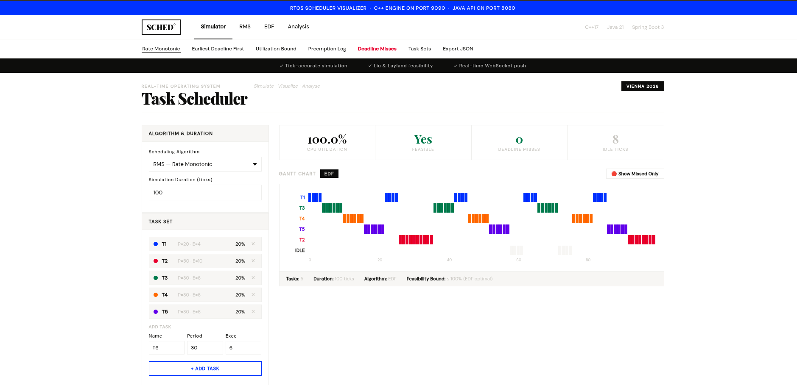
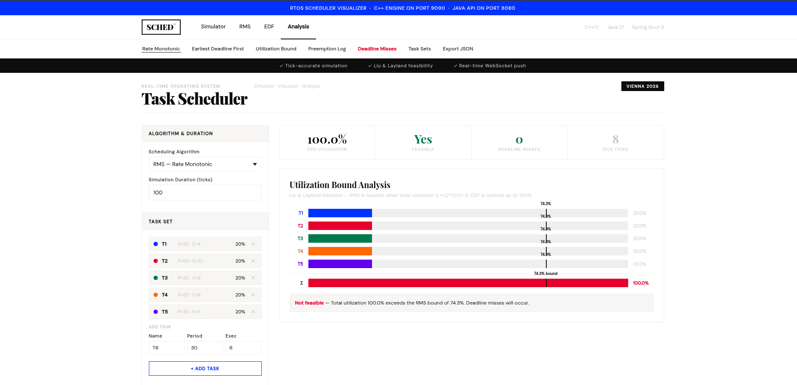
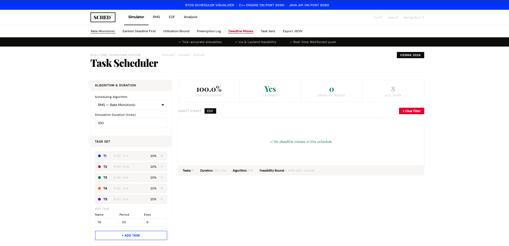
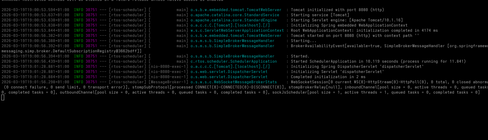

# RTOS Scheduler Simulator

A project that simulates how a real-time operating system (RTOS) decides which tasks to run and when. Built with C++ for the core logic and Java for the web interface.


 

---

## What it does

You give it a list of tasks — each with a name, how often it needs to run (period), and how long it takes (execution time). It then simulates a CPU scheduler and shows you a Gantt chart of which task ran at each tick, whether any deadlines were missed, and how loaded the CPU is.

Two scheduling algorithms are supported:

- **RMS (Rate Monotonic Scheduling)** — shorter period = higher priority. Classic fixed-priority algorithm.
- **EDF (Earliest Deadline First)** — whichever task has the closest deadline runs next. Optimal for CPU utilization.

---

## How it's built
```
cpp/        C++ scheduler engine
java/       Java Spring Boot API
frontend/   Browser dashboard (single HTML file)
docker/     Dockerfiles + docker-compose
```

### C++ Engine (port 9090)
- Implements RMS and EDF from scratch using `std::thread` and `std::chrono`
- Detects deadline misses and idle ticks
- Listens on a TCP socket and returns schedule results as JSON
- Built with CMake, tested with Google Test, can be profiled with Valgrind

### Java API (port 8080)
- Spring Boot REST API that receives task configs from the browser
- Connects to the C++ engine over TCP, sends the request, gets JSON back
- Pushes results to the browser over WebSocket (STOMP)
- One endpoint: `POST /api/schedule`

### Frontend
- Single `index.html` file, no build step needed
- Shows a Gantt chart, CPU utilization stats, and deadline miss highlights
- RMS/EDF tabs switch the algorithm
- "Deadline Misses" button filters the Gantt to show only missed ticks
- "Analysis" tab shows a Liu & Layland utilization bar chart
- "Export JSON" downloads the full schedule result

---

## How to run it

**1. Build the C++ engine**
```bash
cd cpp/build
cmake .. && make -j$(nproc)
```

**2. Build the Java API**
```bash
cd java
mvn clean package -q
```

**3. Start both servers (two terminals)**
```bash
# Terminal 1
cd cpp/build && ./scheduler_server

# Terminal 2
cd java && java -jar target/scheduler-0.0.1-SNAPSHOT.jar
```

**4. Open the dashboard**
```bash
xdg-open frontend/index.html
```

---

## API
```
POST http://localhost:8080/api/schedule
Content-Type: application/json

{
  "algo": "RMS",
  "duration": 100,
  "tasks": [
    { "name": "T1", "period": 20, "execution": 4 },
    { "name": "T2", "period": 50, "execution": 10 }
  ]
}
```

Returns a JSON object with the algorithm used, CPU utilization, feasibility flag, and an event for every tick.

---

## Tech used

| Layer     | Tech                          |
|-----------|-------------------------------|
| Scheduler | C++17, CMake, Google Test     |
| API       | Java 21, Spring Boot 3        |
| Realtime  | WebSocket, STOMP              |
| Frontend  | Vanilla HTML/CSS/JS           |
| DevOps    | Docker, docker-compose        |

---
